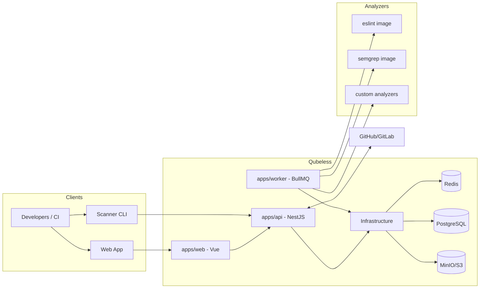

# Qubeless Monorepo

Qubeless is an open source, self-hosted code quality platform for engineering teams.
It centralizes static analysis, quality gates, PR/MR feedback, and operational observability.

## Key Features

- Multi-analyzer execution through containerized analyzers
- Quality gates for overall and new-code criteria
- GitHub and GitLab PR/MR integration (status + automated comments)
- API tokens for CI automation
- Scanner CLI for local and CI submissions
- Metrics and issue tracking from one platform

## Monorepo Structure

- `apps/api`: NestJS API (Fastify, Prisma, auth, webhooks, integrations)
- `apps/web`: Main product UI
- `apps/site`: Marketing/documentation website
- `apps/worker`: BullMQ worker orchestrating analysis jobs
- `packages/shared`: Shared types and DTOs
- `packages/scanner`: Scanner CLI package
- `analyzers/*`: Analyzer container images and docs

## Technical Architecture



## Prerequisites

- Node.js 20+
- pnpm 8+ (`corepack enable`)
- Docker and Docker Compose

## Local Installation

```bash
pnpm install
pnpm db:migrate
pnpm db:generate
pnpm dev
```

Environment configuration:

- Set the required environment variables for API/worker/web based on the `.env.production` variable list in [docs/en/deploy.md](docs/en/deploy.md)
- Make sure PostgreSQL, Redis, and S3-compatible storage settings are valid

## Docker Quick Start

```bash
docker-compose -f docker-compose.dev.yml up --build
```

Main services:

- API: `http://localhost:3001/api` (Swagger: `/api/docs`)
- Web: `http://localhost:8081`
- PostgreSQL: `localhost:5432`
- Redis: `localhost:6379`
- MinIO: `localhost:9000` (console `:9001`)

## Common Commands

- `pnpm dev`: run all apps in development mode
- `pnpm build`: build all packages/apps
- `pnpm lint`: run lint checks
- `pnpm format`: run formatting tasks
- `pnpm db:migrate`: run Prisma migrations
- `pnpm submit`: submit a project analysis
- `pnpm scanner run ...`: advanced scanner workflow
- `pnpm test`: run unit, integration, and e2e test suites

## Pull Request / Merge Request Integration

- Webhooks:
  - `POST /api/webhooks/github`
  - `POST /api/webhooks/gitlab`
- Supported events:
  - GitHub `pull_request` (`opened`, `synchronize`, `reopened`)
  - GitLab merge requests (`open`, `update`, `reopen`)
- Worker automation:
  - `Code Quality` status checks
  - PR/MR summary comments with quality gate and new issues

## Production Deployment

```bash
touch .env.production
# Populate it with the variables documented in docs/en/deploy.md
./scripts/validate-prod-config.sh
docker-compose -f docker-compose.prod.yml --env-file .env.production up -d
```

Deployment guides:

- [Production Deployment Guide](docs/en/deploy.md)
- [Deployment Summary](docs/en/DEPLOYMENT_SUMMARY.md)
- [Backup and Restore](docs/en/backup-restore.md)

## Documentation

- Main index: [docs/README.md](docs/README.md)

Documentation website:

- Run `pnpm --filter @qubeless/site dev`
- Open `http://localhost:5173/#/docs`
- Optional: set `VITE_SWAGGER_UI_URL` (for example `/api/docs` in local dev, or `https://api.your-domain.com/api/docs` in prod) to control Swagger integration in the docs page

Useful English guides:

- [Custom Analyzer Guide](docs/en/custom-analyzer.md)
- [Analyzer Contract](docs/en/analyzer-contract.md)
- [PR/MR Webhooks](docs/en/pr-webhooks.md)
- [Local Submit](docs/en/local-submit.md)
- [Testing](docs/en/testing.md)
- [Security](docs/en/security.md)
- [Security Policy](SECURITY.md)

## License

This project is licensed under the MIT License. See [LICENSE](LICENSE).
