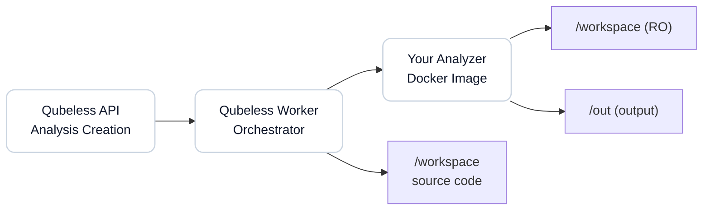

# Guide: Creating and Integrating a Custom Analyzer

This guide explains how to create your own custom analyzer for Qubeless and integrate it into your platform.

## Table of Contents

1. [Overview](#overview)
2. [Analyzer Contract](#analyzer-contract)
3. [Creating Your Analyzer](#creating-your-analyzer)
4. [Implementation Examples](#implementation-examples)
5. [Registering the Analyzer in Qubeless](#registering-the-analyzer-in-qubeless)
6. [Testing Your Analyzer](#testing-your-analyzer)
7. [Troubleshooting](#troubleshooting)

---

## Overview

An analyzer in Qubeless is a Docker container that:

- Receives source code to analyze via a read-only mounted volume
- Performs static code analysis
- Produces standardized output files (issue report, metrics)

The Qubeless worker orchestrates the execution of all configured analyzers for a project and aggregates the results.


### Architecture



---

## Analyzer Contract

### Mounted Volumes

Your container will receive two volumes:

| Volume    | Path         | Mode       | Description                    |
| --------- | ------------ | ---------- | ------------------------------ |
| Workspace | `/workspace` | Read-only  | Project source code to analyze |
| Output    | `/out`       | Read/write | Directory for output files     |

### Required Output Files

Your analyzer **MUST** produce these 3 files in `/out`:

#### 1. `report.json` - Issue Report

Format:

```json
{
  "analyzer": {
    "name": "your-analyzer-name",
    "version": "1.0.0"
  },
  "issues": [
    {
      "ruleKey": "unique-rule-identifier",
      "severity": "INFO|MINOR|MAJOR|CRITICAL|BLOCKER",
      "type": "BUG|CODE_SMELL|VULNERABILITY",
      "filePath": "relative/path/to/file.js",
      "line": 42,
      "message": "Description of the detected problem",
      "fingerprint": "unique-stable-hash-of-the-issue"
    }
  ],
  "rules": [
    {
      "key": "unique-rule-identifier",
      "name": "Short rule name",
      "description": "Detailed rule description",
      "severity": "INFO|MINOR|MAJOR|CRITICAL|BLOCKER",
      "type": "BUG|CODE_SMELL|VULNERABILITY"
    }
  ]
}
```

**Required Fields:**

- `analyzer.name`: Your analyzer name (string)
- `analyzer.version`: Your analyzer version (string)
- `issues`: Array of issues (can be empty)
- For each issue:
  - `ruleKey`: Unique rule identifier (e.g., `my-analyzer:no-console`)
  - `severity`: Severity level (enum)
  - `type`: Issue type (enum)
  - `filePath`: Path relative to workspace
  - `message`: Issue description
  - `fingerprint`: Stable hash for tracking the issue over time

**Optional Fields:**

- `line`: Line number (number | null)
- `rules`: Catalog of available rules (recommended)
- `ruleName`, `ruleDescription`: Rule metadata (deprecated, use `rules`)

**Important:** The `fingerprint` must be stable and deterministic to enable issue tracking across analyses. Recommendation: `sha256(ruleKey|filePath|line|message)`.

#### 2. `measures.json` - Metrics

Format:

```json
{
  "metrics": {
    "issues_total": 10,
    "issues_blocker": 0,
    "issues_critical": 1,
    "issues_major": 5,
    "issues_minor": 4,
    "issues_info": 0,
    "duplicated_lines": 120,
    "complexity": 42
  }
}
```

**Required Fields:**

- `metrics`: Object with key-value pairs (string → number)

**Standard Metrics:**

- `issues_total`: Total number of issues
- `issues_blocker`, `issues_critical`, `issues_major`, `issues_minor`, `issues_info`: Counters by severity
- `issues_by_type.bug`, `issues_by_type.code_smell`, `issues_by_type.vulnerability`: Counters by type

You can add your own custom metrics (e.g., `duplicated_lines`, `complexity`).

#### 3. `run.log` - Execution Logs

Text file containing your analyzer logs (for debugging).

```
Starting MyAnalyzer v1.0.0
Workspace: /workspace
Analyzing 42 files...
Found 10 issues
Analysis completed successfully
```

---

## Creating Your Analyzer

### Step 1: Project Structure

Create a directory for your analyzer:

```bash
mkdir my-custom-analyzer
cd my-custom-analyzer
```

Recommended structure:

```
my-custom-analyzer/
├── Dockerfile
├── entrypoint.sh
├── analyzer-script.py  # or .js, .sh, etc.
└── README.md
```

### Step 2: Dockerfile

Basic `Dockerfile` example:

```dockerfile
FROM python:3.11-slim

WORKDIR /app

# Install your dependencies
RUN pip install --no-cache-dir \
    pylint==3.0.0 \
    bandit==1.7.5

# Copy your analysis script
COPY entrypoint.sh /app/entrypoint.sh
COPY analyzer-script.py /app/analyzer-script.py

RUN chmod +x /app/entrypoint.sh

# Environment variables
ENV WORKSPACE=/workspace \
    OUT_DIR=/out

ENTRYPOINT ["/app/entrypoint.sh"]
```

**Best Practices:**

- Use lightweight base images (`-slim`, `-alpine`)
- Pin dependency versions
- Minimize the number of layers
- Don't include secrets in the image

### Step 3: Entry Script (entrypoint.sh)

```bash
#!/usr/bin/env bash
set -euo pipefail

OUT_DIR=${OUT_DIR:-/out}
WORKSPACE=${WORKSPACE:-/workspace}

mkdir -p "$OUT_DIR"

REPORT_JSON="$OUT_DIR/report.json"
MEASURES_JSON="$OUT_DIR/measures.json"
RUN_LOG="$OUT_DIR/run.log"

echo "Starting MyAnalyzer" > "$RUN_LOG"
echo "Workspace: $WORKSPACE" >> "$RUN_LOG"

# Run your analyzer
python /app/analyzer-script.py \
  --workspace "$WORKSPACE" \
  --report "$REPORT_JSON" \
  --measures "$MEASURES_JSON" \
  >> "$RUN_LOG" 2>&1

EXIT_CODE=$?

echo "Analysis completed with exit code: $EXIT_CODE" >> "$RUN_LOG"
exit $EXIT_CODE
```

### Step 4: Analysis Script

Python example (`analyzer-script.py`):

```python
#!/usr/bin/env python3
import json
import hashlib
import argparse
from pathlib import Path

def analyze_workspace(workspace_path):
    """Your analysis logic here"""
    issues = []
    rules = []

    # Example: iterate through Python files
    for py_file in Path(workspace_path).rglob('*.py'):
        rel_path = py_file.relative_to(workspace_path)

        # Your detection logic
        with open(py_file, 'r', encoding='utf-8') as f:
            for line_num, line in enumerate(f, start=1):
                if 'TODO' in line:
                    # Create an issue
                    fingerprint_source = f"my-analyzer:todo-found|{rel_path}|{line_num}"
                    fingerprint = hashlib.sha256(
                        fingerprint_source.encode()
                    ).hexdigest()

                    issues.append({
                        "ruleKey": "my-analyzer:todo-found",
                        "severity": "INFO",
                        "type": "CODE_SMELL",
                        "filePath": str(rel_path),
                        "line": line_num,
                        "message": f"TODO comment found: {line.strip()}",
                        "fingerprint": fingerprint
                    })

    # Define rule catalog
    rules.append({
        "key": "my-analyzer:todo-found",
        "name": "TODO Comment Found",
        "description": "Detects TODO comments in code",
        "severity": "INFO",
        "type": "CODE_SMELL"
    })

    return issues, rules

def calculate_metrics(issues):
    """Calculate metrics"""
    metrics = {
        "issues_total": len(issues),
        "issues_blocker": sum(1 for i in issues if i["severity"] == "BLOCKER"),
        "issues_critical": sum(1 for i in issues if i["severity"] == "CRITICAL"),
        "issues_major": sum(1 for i in issues if i["severity"] == "MAJOR"),
        "issues_minor": sum(1 for i in issues if i["severity"] == "MINOR"),
        "issues_info": sum(1 for i in issues if i["severity"] == "INFO"),
    }
    return metrics

def main():
    parser = argparse.ArgumentParser()
    parser.add_argument('--workspace', required=True)
    parser.add_argument('--report', required=True)
    parser.add_argument('--measures', required=True)
    args = parser.parse_args()

    # Analyze workspace
    issues, rules = analyze_workspace(args.workspace)
    metrics = calculate_metrics(issues)

    # Generate report.json
    report = {
        "analyzer": {
            "name": "my-custom-analyzer",
            "version": "1.0.0"
        },
        "issues": issues,
        "rules": rules
    }
    with open(args.report, 'w') as f:
        json.dump(report, f, indent=2)

    # Generate measures.json
    measures = {"metrics": metrics}
    with open(args.measures, 'w') as f:
        json.dump(measures, f, indent=2)

    print(f"Analysis complete: {len(issues)} issues found")

if __name__ == '__main__':
    main()
```

### Step 5: Build Docker Image

```bash
docker build -t my-custom-analyzer:1.0.0 .
```

**For a private registry:**

```bash
docker build -t ghcr.io/my-org/my-custom-analyzer:1.0.0 .
docker push ghcr.io/my-org/my-custom-analyzer:1.0.0
```

---

## Implementation Examples

### Example 1: ESLint-based Analyzer (Node.js)

See: [`analyzers/eslint/`](../../analyzers/eslint/)

Key points:

- Uses the project's ESLint if it exists, otherwise a bundled version
- Handles workspace ESLint configurations
- Normalizes file paths
- Extracts complete ESLint rule catalog

### Example 2: Semgrep-based Analyzer (Python)

See: [`analyzers/semgrep/`](../../analyzers/semgrep/)

Key points:

- Uses official Semgrep image
- Custom configuration support (`--config`)
- Maps Semgrep severities to Qubeless
- Infers issue type based on metadata

### Example 3: Simple Shell Analyzer

```dockerfile
FROM alpine:3.18

RUN apk add --no-cache bash shellcheck jq

COPY entrypoint.sh /entrypoint.sh
RUN chmod +x /entrypoint.sh

ENV WORKSPACE=/workspace \
    OUT_DIR=/out

ENTRYPOINT ["/entrypoint.sh"]
```

```bash
#!/usr/bin/env bash
set -euo pipefail

OUT_DIR=${OUT_DIR:-/out}
WORKSPACE=${WORKSPACE:-/workspace}

mkdir -p "$OUT_DIR"

REPORT_JSON="$OUT_DIR/report.json"
MEASURES_JSON="$OUT_DIR/measures.json"
RUN_LOG="$OUT_DIR/run.log"

echo "Starting ShellCheck Analyzer" > "$RUN_LOG"

# Find all shell scripts
ISSUES=()
for script in $(find "$WORKSPACE" -type f -name "*.sh"); do
  REL_PATH=$(realpath --relative-to="$WORKSPACE" "$script")

  # Run shellcheck
  shellcheck -f json "$script" 2>>"$RUN_LOG" | jq -c '.[]' | while read -r issue; do
    LINE=$(echo "$issue" | jq -r '.line')
    MESSAGE=$(echo "$issue" | jq -r '.message')
    CODE=$(echo "$issue" | jq -r '.code')
    LEVEL=$(echo "$issue" | jq -r '.level')

    # Map severity
    SEVERITY="MINOR"
    case "$LEVEL" in
      error) SEVERITY="MAJOR" ;;
      warning) SEVERITY="MINOR" ;;
      info|style) SEVERITY="INFO" ;;
    esac

    # Calculate fingerprint
    FINGERPRINT=$(echo -n "shellcheck:$CODE|$REL_PATH|$LINE|$MESSAGE" | sha256sum | cut -d' ' -f1)

    ISSUES+=("{
      \"ruleKey\": \"shellcheck:$CODE\",
      \"severity\": \"$SEVERITY\",
      \"type\": \"CODE_SMELL\",
      \"filePath\": \"$REL_PATH\",
      \"line\": $LINE,
      \"message\": \"$MESSAGE\",
      \"fingerprint\": \"$FINGERPRINT\"
    }")
  done
done

# Generate report.json
cat > "$REPORT_JSON" <<EOF
{
  "analyzer": {
    "name": "shellcheck",
    "version": "$(shellcheck --version | grep version: | cut -d' ' -f2)"
  },
  "issues": [${ISSUES[*]}]
}
EOF

# Generate measures.json
TOTAL=${#ISSUES[@]}
cat > "$MEASURES_JSON" <<EOF
{
  "metrics": {
    "issues_total": $TOTAL
  }
}
EOF

echo "Analysis completed: $TOTAL issues found" >> "$RUN_LOG"
```

---

## Registering the Analyzer in Qubeless

### Option 1: Via REST API

```bash
# Create analyzer at global level
curl -X POST http://localhost:3001/api/analyzers \
  -H "Content-Type: application/json" \
  -H "Authorization: Bearer YOUR_TOKEN" \
  -d '{
    "key": "my-custom-analyzer",
    "name": "My Custom Analyzer",
    "dockerImage": "ghcr.io/my-org/my-custom-analyzer:1.0.0",
    "enabled": true
  }'
```

**Parameters:**

- `key`: Unique analyzer identifier (alphanumeric, dashes, underscores)
- `name`: Display name
- `dockerImage`: Full Docker image (with registry and tag)
- `enabled`: `true` to enable globally, `false` to disable

### Option 2: Via Web Interface

1. Log in as administrator
2. Go to **Admin** > \*_Analy:3001_
3. Click **Add Analyzer**
4. Fill in the form:
   - **Key**: `my-custom-analyzer`
   - **Name**: `My Custom Analyzer`
   - **Docker Image**: `ghcr.io/my-org/my-custom-analyzer:1.0.0`
   - **Enabled**: ✓
5. Click **Create**

### Enable Analyzer for a Project

```bash
# Enable analyzer for a specific project
curl -X PUT http://localhost:3001/api/projects/my-project/analyzers/my-custom-analyzer \
  -H "Content-Type: application/json" \
  -H "Authorization: Bearer YOUR_TOKEN" \
  -d '{
    "enabled": true,
    "configJson": {
      "customOption": "value"
    }
  }'
```

**Optional Parameters:**

- `configJson`: Project-specific configuration (free-form JSON object)

### Advanced Configuration

Your analyzer can receive custom configuration via `configJson`. This configuration is available in the container's environment variables.

Example in the worker (already handled):

```typescript
const payload: AnalysisJobPayload = {
  analyzers: [
    {
      key: 'my-custom-analyzer',
      dockerImage: 'ghcr.io/my-org/my-custom-analyzer:1.0.0',
      configJson: { strictMode: true, excludePatterns: ['*.test.js'] },
    },
  ],
};
```

To use this config in your analyzer:

```bash
# In entrypoint.sh
CONFIG_JSON=${ANALYZER_CONFIG:-"{}"}
echo "$CONFIG_JSON" > /tmp/config.json

# Pass to your script
python /app/analyzer-script.py --config /tmp/config.json
```

---

## Testing Your Analyzer

### Local Testing with Docker

```bash
# Create test workspace
mkdir -p /tmp/test-workspace
echo "print('TODO: Fix this')" > /tmp/test-workspace/example.py

# Create output directory
mkdir -p /tmp/test-output

# Run your analyzer
docker run --rm \
  -v /tmp/test-workspace:/workspace:ro \
  -v /tmp/test-output:/out \
  my-custom-analyzer:1.0.0

# Verify results
cat /tmp/test-output/report.json | jq
cat /tmp/test-output/measures.json | jq
cat /tmp/test-output/run.log
```

### Format Validation

Use the Qubeless TypeScript validator:

```typescript
import { assertAnalyzerReport, assertAnalyzerMeasures } from '@qubeless/shared';

// Read your files
const report = JSON.parse(fs.readFileSync('/tmp/test-output/report.json', 'utf8'));
const measures = JSON.parse(fs.readFileSync('/tmp/test-output/measures.json', 'utf8'));

// Validate
try {
  assertAnalyzerReport(report);
  console.log('✓ report.json valid');
} catch (error) {
  console.error('✗ report.json invalid:', error.message);
}

try {
  assertAnalyzerMeasures(measures);
  console.log('✓ measures.json valid');
} catch (error) {
  console.error('✗ measures.json invalid:', error.message);
}
```

### Testing in Qubeless

1. Register the analyzer (see previous section)
2. Enable it for a test project
3. Launch an analysis:

```bash
curl -X POST http://localhost:3001/api/projects/test-project/analyses \
  -H "Content-Type: application/json" \
  -H "Authorization: Bearer YOUR_TOKEN" \
  -d '{
    "commitSha": "abc123",
    "branchName": "main"
  }'
```

4. Check worker logs to see execution
5. Verify results in the web interface

---

## Troubleshooting

### Analyzer Doesn't Produce Output Files

**Symptom:** Worker reports missing files (`report.json` or `measures.json`).

**Solution:**

- Verify your script writes to `/out` (not `/output` or other)
- Test locally with Docker to see errors
- Check `run.log` to understand where the script fails
- Ensure permissions are correct (`mkdir -p "$OUT_DIR"`)

### Invalid JSON Format

**Symptom:** Error `Invalid report` or `Invalid measures` in worker logs.

**Solution:**

- Validate your JSON with `jq`: `cat report.json | jq`
- Check types: `severity` must be a string among allowed values
- Use TypeScript validator (see Testing section)
- Verify all required fields are present

### Analyzer Timeout

**Symptom:** Analysis is interrupted after 5 minutes.

**Solution:**

- Optimize your analyzer to handle large projects
- Add progress logs in `run.log`
- Configure custom timeout in worker (`ANALYZER_TIMEOUT_MS` variable)
- Exclude irrelevant directories (`node_modules`, `.git`, etc.)

### Incorrect File Paths

**Symptom:** Issues point to non-existent files.

**Solution:**

- Paths in `filePath` must be **relative** to workspace
- Use `path.relative(workspace, absolutePath)` (Node.js) or `os.path.relpath(path, workspace)` (Python)
- Never start with `/` or `./`

### Docker Image Not Found

**Symptom:** Error `Image not found` or `pull access denied`.

**Solution:**

- Verify image exists: `docker pull ghcr.io/my-org/my-custom-analyzer:1.0.0`
- For private registry, configure Docker authentication on worker
- Check full image name (registry + name + tag)
- Push image if it's only local: `docker push ...`

### Duplicate Issues Between Analyses

**Symptom:** Same issues appear as "new" on every analysis.

**Solution:**

- `fingerprint` must be stable and deterministic
- Use: `sha256(ruleKey + filePath + line + message)`
- Don't base fingerprint on variable elements (timestamps, auto-incremented IDs)
- Test: two analyses of the same code must produce identical fingerprints

---

## Resources

### References

- [Analyzer Contract](./analyzer-contract.md) - Detailed technical specification
- [TypeScript Types](../../packages/shared/src/index.ts) - Interface definitions
- [Validators](../../packages/shared/src/validators/analyzer.ts) - Validation schemas

### Examples in Repository

- [ESLint Analyzer](../../analyzers/eslint/) - Complex Node.js example
- [Semgrep Analyzer](../../analyzers/semgrep/) - Python example

### Support

- GitHub Issues: [qubeless-monorepo/issues](https://github.com/qubeless/qubeless-monorepo/issues)
- General Documentation: [README.md](../../README.md)

---

**Happy developing!**
