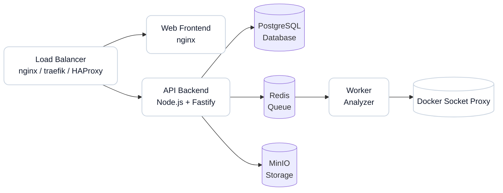

# Production Deployment Guide

Single production guide for deploying, debugging, and monitoring Qubeless.

## Fast Path (Deploy + Verify)

```bash
touch .env.production
# Populate it with the variables from the ".env.production Example" section below
./scripts/validate-prod-config.sh
docker-compose -f docker-compose.prod.yml --env-file .env.production up -d
docker-compose -f docker-compose.prod.yml ps
curl http://localhost:3001/api/health
```

## Fast Path (Debug + Monitor)

```bash
# live logs
docker-compose -f docker-compose.prod.yml logs -f

# service health
docker-compose -f docker-compose.prod.yml ps
curl http://localhost:3001/api/health

# metrics (if enabled)
curl http://localhost:3001/api/metrics
```

## Prerequisites

### System

- **OS**: Linux (Ubuntu 22.04 LTS recommended)
- **Docker**: Version 24.0 or higher
- **Docker Compose**: Version 2.20 or higher
- **CPU**: Minimum 4 cores (8 cores recommended)
- **RAM**: Minimum 8 GB (16 GB recommended)
- **Disk**: Minimum 50 GB of free space (SSD recommended)

### Required Ports

The following ports must be available:

- `3001`: API Backend (configurable via `API_PORT`)
- `8081`: Web Frontend (configurable via `WEB_PORT`)
- `5432`: PostgreSQL (configurable via `POSTGRES_PORT`)
- `6379`: Redis (configurable via `REDIS_PORT`)
- `9000`: MinIO API (configurable via `MINIO_PORT`)
- `9001`: MinIO Console (configurable via `MINIO_CONSOLE_PORT`)

### Network Access

- Outbound access to Docker Hub to download images
- Outbound access to Git repositories if analysis of external projects is required

### Docker Socket Exposure (Worker)

The worker connects to an internal `docker-socket-proxy` service (via `DOCKER_HOST=tcp://docker-proxy:2375`) to launch analyzer containers.
The proxy is the only service mounting `/var/run/docker.sock` (read-only) and is isolated on an internal network.
This reduces direct socket exposure from the worker, but Docker daemon access is still a high-impact trust boundary.

Recommended protections:

- Run Qubeless on a dedicated host or dedicated VM for isolation
- Keep the docker socket proxy on an internal-only network and expose only required Docker API endpoints
- Restrict who can exec into the worker container and who can manage Docker on the host
- Keep the worker service private (no published ports) and segment host/network access
- Prefer hardened hosts (minimal services, patched OS, audited Docker group membership)
- Review [Security Policy](../../SECURITY.md) before production rollout

## Deployment Architecture



### Components

- **Web**: Vue.js frontend served by nginx
- **API**: Node.js backend with Fastify
- **Worker**: Asynchronous analysis service
- **PostgreSQL**: Relational database
- **Redis**: Cache and job queue
- **MinIO**: S3-compatible object storage

## Quick Installation

### 1. Clone the Repository

```bash
git clone https://github.com/qubeless/qubeless-monorepo.git
cd qubeless-monorepo
```

### 2. Create the Environment File

```bash
touch .env.production
```

### 3. Configure Environment Variables

Populate `.env.production` with the variables from the `.env.production` example block in this guide and replace values for your environment.

### 4. Create Data Directories

```bash
mkdir -p volumes/{postgres,redis,minio}
mkdir -p /tmp/{workspaces,analyzer-out}
```

### 5. Start Services

```bash
docker-compose -f docker-compose.prod.yml --env-file .env.production up -d
```

### 6. Verify Deployment

```bash
# Check that all services are running
docker-compose -f docker-compose.prod.yml ps

# Check logs
docker-compose -f docker-compose.prod.yml logs -f

# Test the API
curl http://localhost:3001/api/health

# Test the frontend
curl http://localhost:8081
```

## .env.production Example

```env
# Version
VERSION=latest

# Data Directory
DATA_DIR=./volumes

# PostgreSQL
POSTGRES_USER=postgres
POSTGRES_PASSWORD=changeme_secure_password
POSTGRES_DB=qubeless
POSTGRES_PORT=5432

# Redis
REDIS_PORT=6379

# MinIO
MINIO_ROOT_USER=minio_admin
MINIO_ROOT_PASSWORD=changeme_secure_minio_password
MINIO_PUBLIC_ENDPOINT=https://minio.example.com
MINIO_BUCKET_SOURCES=sources
MINIO_BUCKET_ARTIFACTS=artifacts
MINIO_PORT=9000
MINIO_CONSOLE_PORT=9001

# API
API_PORT=3001
JWT_SECRET=changeme_generate_a_secure_random_key_min_32_characters
JWT_EXPIRES_IN=7d
ADMIN_EMAIL=admin@example.com
ADMIN_PASSWORD=changeme_secure_admin_password
FRONTEND_ORIGIN=https://qubeless.example.com
AUTHZ_MODE=STRICT
MAX_RUNNING_ANALYSES=5
MAX_RUNNING_PER_PROJECT=2
METRICS_ENABLED=true

# Web
WEB_PORT=8081
VITE_API_URL=https://api.example.com/api
WEB_CSP_CONNECT_SRC=https://api.example.com

# Worker
WORKER_CONCURRENCY=2
WORKER_JOB_ATTEMPTS=2
WORKER_BACKOFF_MS=5000
ANALYZER_TIMEOUT_MS=600000
ANALYZER_MEMORY_MB=1024
ANALYZER_CPU_LIMIT=1
DOCKER_HOST=tcp://docker-proxy:2375
LOG_LEVEL=info
WORKSPACE_PATH=/workspace

# Site (optional)
SITE_BIND_HOST=127.0.0.1
SITE_PORT=8082
SITE_VITE_DOMAIN_APP=https://app.example.com
SITE_VITE_DOCS_URL=https://docs.example.com
SITE_VITE_GITHUB_URL=https://github.com/qubeless/qubeless-monorepo
SITE_VITE_SWAGGER_UI_URL=/api/docs
SITE_VITE_API_URL=

# SSO (optional)
SSO_OIDC_ENABLED=false
SSO_SAML_ENABLED=false
```

## Starting Services

### Full Start

```bash
docker-compose -f docker-compose.prod.yml --env-file .env.production up -d
```

### Start with Rebuild

```bash
docker-compose -f docker-compose.prod.yml --env-file .env.production up -d --build
```

### Start a Specific Service

```bash
docker-compose -f docker-compose.prod.yml --env-file .env.production up -d api
```

### Stop Services

```bash
# Graceful shutdown
docker-compose -f docker-compose.prod.yml down

# Stop with volume removal (WARNING: data loss!)
docker-compose -f docker-compose.prod.yml down -v
```

### Restart Services

```bash
# Restart all services
docker-compose -f docker-compose.prod.yml restart

# Restart a specific service
docker-compose -f docker-compose.prod.yml restart api
```

## Data Management

### Volume Structure

```
volumes/
├── postgres/          # PostgreSQL data
├── redis/            # Redis data (AOF)
└── minio/            # MinIO objects (sources, artifacts)

/tmp/
├── workspaces/       # Temporary work directories
└── analyzer-out/     # Temporary analysis results
```

### Disk Space Verification

```bash
# Total space used by volumes
du -sh volumes/

# Space per service
du -sh volumes/postgres
du -sh volumes/redis
du -sh volumes/minio
```

### Cleanup

```bash
# Clean temporary workspaces
docker-compose -f docker-compose.prod.yml exec worker sh -c "rm -rf /tmp/workspaces/*"

# Clean temporary analysis results
docker-compose -f docker-compose.prod.yml exec worker sh -c "rm -rf /tmp/analyzer-out/*"

# Clean unused Docker images
docker image prune -a
```

## Monitoring and Health

### Service Status Verification

```bash
# Status of all services
docker-compose -f docker-compose.prod.yml ps

# Health of services with healthcheck
docker-compose -f docker-compose.prod.yml ps | grep healthy
```

### Healthchecks

Each service exposes a healthcheck:

- **PostgreSQL**: `pg_isready -U postgres`
- **Redis**: `redis-cli ping`
- **MinIO**: `curl http://localhost:9000/minio/health/live`
- **API**: `http://localhost:3001/api/health`
- **Web**: `http://localhost:8081/`

### Logs

```bash
# View all logs
docker-compose -f docker-compose.prod.yml logs -f

# Logs for a specific service
docker-compose -f docker-compose.prod.yml logs -f api

# Last 100 lines
docker-compose -f docker-compose.prod.yml logs --tail=100 api

# Logs with timestamps
docker-compose -f docker-compose.prod.yml logs -f --timestamps
```

### Prometheus Metrics

If `METRICS_ENABLED=true`, Prometheus metrics are available at:

```
http://localhost:3001/api/metrics
```

Example Prometheus scrape config:

```yaml
scrape_configs:
  - job_name: 'qubeless-api'
    static_configs:
      - targets: ['api.example.com:3001']
    metrics_path: '/api/metrics'
```

### System Resources

```bash
# CPU/RAM usage of containers
docker stats

# Usage for a specific service
docker stats qubeless-api

# Top processes in a container
docker-compose -f docker-compose.prod.yml exec api top
```

## Useful Commands

```bash
# Useful aliases to add to ~/.bashrc
alias qube-up='docker-compose -f docker-compose.prod.yml --env-file .env.production up -d'
alias qube-down='docker-compose -f docker-compose.prod.yml down'
alias qube-logs='docker-compose -f docker-compose.prod.yml logs -f'
alias qube-ps='docker-compose -f docker-compose.prod.yml ps'
alias qube-restart='docker-compose -f docker-compose.prod.yml restart'
```
