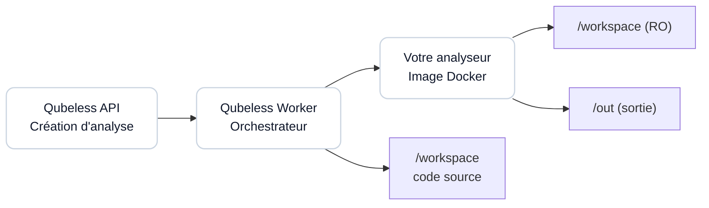

# Guide : Créer et Intégrer un Analyseur Custom

Ce guide explique comment créer votre propre analyseur personnalisé pour Qubeless et l'intégrer dans votre plateforme.

## Table des matières

1. [Vue d'ensemble](#vue-densemble)
2. [Contrat de l'analyseur](#contrat-de-lanalyseur)
3. [Créer votre analyseur](#créer-votre-analyseur)
4. [Exemples d'implémentation](#exemples-dimplémentation)
5. [Enregistrer l'analyseur dans Qubeless](#enregistrer-lanalyseur-dans-qubeless)
6. [Tester votre analyseur](#tester-votre-analyseur)
7. [Dépannage](#dépannage)

---

## Vue d'ensemble

Un analyseur dans Qubeless est un conteneur Docker qui :

- Reçoit le code source à analyser via un volume monté en lecture seule
- Exécute une analyse statique du code
- Produit des fichiers de sortie normalisés (rapport d'issues, métriques)

Le worker Qubeless orchestre l'exécution de tous les analyseurs configurés pour un projet et agrège les résultats.


### Architecture



---

## Contrat de l'analyseur

### Volumes montés

Votre conteneur recevra deux volumes :

| Volume    | Chemin       | Mode             | Description                            |
| --------- | ------------ | ---------------- | -------------------------------------- |
| Workspace | `/workspace` | Lecture seule    | Code source du projet à analyser       |
| Output    | `/out`       | Lecture/écriture | Répertoire pour les fichiers de sortie |

### Fichiers de sortie obligatoires

Votre analyseur **DOIT** produire ces 3 fichiers dans `/out` :

#### 1. `report.json` - Rapport d'issues

Format :

```json
{
  "analyzer": {
    "name": "nom-de-votre-analyseur",
    "version": "1.0.0"
  },
  "issues": [
    {
      "ruleKey": "identifiant-unique-de-la-regle",
      "severity": "INFO|MINOR|MAJOR|CRITICAL|BLOCKER",
      "type": "BUG|CODE_SMELL|VULNERABILITY",
      "filePath": "chemin/relatif/vers/fichier.js",
      "line": 42,
      "message": "Description du problème détecté",
      "fingerprint": "hash-unique-stable-de-lissue"
    }
  ],
  "rules": [
    {
      "key": "identifiant-unique-de-la-regle",
      "name": "Nom court de la règle",
      "description": "Description détaillée de la règle",
      "severity": "INFO|MINOR|MAJOR|CRITICAL|BLOCKER",
      "type": "BUG|CODE_SMELL|VULNERABILITY"
    }
  ]
}
```

**Champs obligatoires :**

- `analyzer.name` : Nom de votre analyseur (string)
- `analyzer.version` : Version de votre analyseur (string)
- `issues` : Tableau d'issues (peut être vide)
- Pour chaque issue :
  - `ruleKey` : Identifiant unique de la règle (ex: `my-analyzer:no-console`)
  - `severity` : Niveau de gravité (enum)
  - `type` : Type d'issue (enum)
  - `filePath` : Chemin relatif au workspace
  - `message` : Description de l'issue
  - `fingerprint` : Hash stable pour le suivi de l'issue dans le temps

**Champs optionnels :**

- `line` : Numéro de ligne (number | null)
- `rules` : Catalogue des règles disponibles (recommandé)
- `ruleName`, `ruleDescription` : Métadonnées de la règle (deprecated, utiliser `rules`)

**Important :** Le `fingerprint` doit être stable et déterministe pour permettre le suivi des issues entre analyses. Recommandation : `sha256(ruleKey|filePath|line|message)`.

#### 2. `measures.json` - Métriques

Format :

```json
{
  "metrics": {
    "issues_total": 10,
    "issues_blocker": 0,
    "issues_critical": 1,
    "issues_major": 5,
    "issues_minor": 4,
    "issues_info": 0,
    "duplicated_lines": 120,
    "complexity": 42
  }
}
```

**Champs obligatoires :**

- `metrics` : Objet avec des paires clé-valeur (string → number)

**Métriques standards :**

- `issues_total` : Nombre total d'issues
- `issues_blocker`, `issues_critical`, `issues_major`, `issues_minor`, `issues_info` : Compteurs par sévérité
- `issues_by_type.bug`, `issues_by_type.code_smell`, `issues_by_type.vulnerability` : Compteurs par type

Vous pouvez ajouter vos propres métriques personnalisées (ex: `duplicated_lines`, `complexity`).

#### 3. `run.log` - Logs d'exécution

Fichier texte contenant les logs de votre analyseur (pour le débogage).

```
Starting MyAnalyzer v1.0.0
Workspace: /workspace
Analyzing 42 files...
Found 10 issues
Analysis completed successfully
```

---

## Créer votre analyseur

### Étape 1 : Structure du projet

Créez un répertoire pour votre analyseur :

```bash
mkdir my-custom-analyzer
cd my-custom-analyzer
```

Structure recommandée :

```
my-custom-analyzer/
├── Dockerfile
├── entrypoint.sh
├── analyzer-script.py  # ou .js, .sh, etc.
└── README.md
```

### Étape 2 : Dockerfile

Exemple de `Dockerfile` basique :

```dockerfile
FROM python:3.11-slim

WORKDIR /app

# Installer vos dépendances
RUN pip install --no-cache-dir \
    pylint==3.0.0 \
    bandit==1.7.5

# Copier votre script d'analyse
COPY entrypoint.sh /app/entrypoint.sh
COPY analyzer-script.py /app/analyzer-script.py

RUN chmod +x /app/entrypoint.sh

# Variables d'environnement
ENV WORKSPACE=/workspace \
    OUT_DIR=/out

ENTRYPOINT ["/app/entrypoint.sh"]
```

**Bonnes pratiques :**

- Utilisez des images de base légères (`-slim`, `-alpine`)
- Fixez les versions de vos dépendances
- Minimisez le nombre de layers
- N'incluez pas de secrets dans l'image

### Étape 3 : Script d'entrée (entrypoint.sh)

```bash
#!/usr/bin/env bash
set -euo pipefail

OUT_DIR=${OUT_DIR:-/out}
WORKSPACE=${WORKSPACE:-/workspace}

mkdir -p "$OUT_DIR"

REPORT_JSON="$OUT_DIR/report.json"
MEASURES_JSON="$OUT_DIR/measures.json"
RUN_LOG="$OUT_DIR/run.log"

echo "Starting MyAnalyzer" > "$RUN_LOG"
echo "Workspace: $WORKSPACE" >> "$RUN_LOG"

# Exécuter votre analyseur
python /app/analyzer-script.py \
  --workspace "$WORKSPACE" \
  --report "$REPORT_JSON" \
  --measures "$MEASURES_JSON" \
  >> "$RUN_LOG" 2>&1

EXIT_CODE=$?

echo "Analysis completed with exit code: $EXIT_CODE" >> "$RUN_LOG"
exit $EXIT_CODE
```

### Étape 4 : Script d'analyse

Exemple en Python (`analyzer-script.py`) :

```python
#!/usr/bin/env python3
import json
import hashlib
import argparse
from pathlib import Path

def analyze_workspace(workspace_path):
    """Votre logique d'analyse ici"""
    issues = []
    rules = []

    # Exemple : parcourir les fichiers Python
    for py_file in Path(workspace_path).rglob('*.py'):
        rel_path = py_file.relative_to(workspace_path)

        # Votre logique de détection
        with open(py_file, 'r', encoding='utf-8') as f:
            for line_num, line in enumerate(f, start=1):
                if 'TODO' in line:
                    # Créer une issue
                    fingerprint_source = f"my-analyzer:todo-found|{rel_path}|{line_num}"
                    fingerprint = hashlib.sha256(
                        fingerprint_source.encode()
                    ).hexdigest()

                    issues.append({
                        "ruleKey": "my-analyzer:todo-found",
                        "severity": "INFO",
                        "type": "CODE_SMELL",
                        "filePath": str(rel_path),
                        "line": line_num,
                        "message": f"TODO comment found: {line.strip()}",
                        "fingerprint": fingerprint
                    })

    # Définir le catalogue des règles
    rules.append({
        "key": "my-analyzer:todo-found",
        "name": "TODO Comment Found",
        "description": "Détecte les commentaires TODO dans le code",
        "severity": "INFO",
        "type": "CODE_SMELL"
    })

    return issues, rules

def calculate_metrics(issues):
    """Calculer les métriques"""
    metrics = {
        "issues_total": len(issues),
        "issues_blocker": sum(1 for i in issues if i["severity"] == "BLOCKER"),
        "issues_critical": sum(1 for i in issues if i["severity"] == "CRITICAL"),
        "issues_major": sum(1 for i in issues if i["severity"] == "MAJOR"),
        "issues_minor": sum(1 for i in issues if i["severity"] == "MINOR"),
        "issues_info": sum(1 for i in issues if i["severity"] == "INFO"),
    }
    return metrics

def main():
    parser = argparse.ArgumentParser()
    parser.add_argument('--workspace', required=True)
    parser.add_argument('--report', required=True)
    parser.add_argument('--measures', required=True)
    args = parser.parse_args()

    # Analyser le workspace
    issues, rules = analyze_workspace(args.workspace)
    metrics = calculate_metrics(issues)

    # Générer report.json
    report = {
        "analyzer": {
            "name": "my-custom-analyzer",
            "version": "1.0.0"
        },
        "issues": issues,
        "rules": rules
    }
    with open(args.report, 'w') as f:
        json.dump(report, f, indent=2)

    # Générer measures.json
    measures = {"metrics": metrics}
    with open(args.measures, 'w') as f:
        json.dump(measures, f, indent=2)

    print(f"Analysis complete: {len(issues)} issues found")

if __name__ == '__main__':
    main()
```

### Étape 5 : Construire l'image Docker

```bash
docker build -t my-custom-analyzer:1.0.0 .
```

**Pour un registre privé :**

```bash
docker build -t ghcr.io/mon-org/my-custom-analyzer:1.0.0 .
docker push ghcr.io/mon-org/my-custom-analyzer:1.0.0
```

---

## Exemples d'implémentation

### Exemple 1 : Analyseur basé sur ESLint (Node.js)

Voir : [`analyzers/eslint/`](../analyzers/eslint/)

Points clés :

- Utilise l'ESLint du projet s'il existe, sinon une version bundled
- Gère les configurations ESLint du workspace
- Normalise les chemins de fichiers
- Extrait le catalogue complet des règles ESLint

### Exemple 2 : Analyseur basé sur Semgrep (Python)

Voir : [`analyzers/semgrep/`](../analyzers/semgrep/)

Points clés :

- Utilise l'image officielle Semgrep
- Support de la configuration custom (`--config`)
- Mapping des sévérités Semgrep vers Qubeless
- Inférence du type d'issue basée sur les métadonnées

### Exemple 3 : Analyseur Shell simple

```dockerfile
FROM alpine:3.18

RUN apk add --no-cache bash shellcheck jq

COPY entrypoint.sh /entrypoint.sh
RUN chmod +x /entrypoint.sh

ENV WORKSPACE=/workspace \
    OUT_DIR=/out

ENTRYPOINT ["/entrypoint.sh"]
```

```bash
#!/usr/bin/env bash
set -euo pipefail

OUT_DIR=${OUT_DIR:-/out}
WORKSPACE=${WORKSPACE:-/workspace}

mkdir -p "$OUT_DIR"

REPORT_JSON="$OUT_DIR/report.json"
MEASURES_JSON="$OUT_DIR/measures.json"
RUN_LOG="$OUT_DIR/run.log"

echo "Starting ShellCheck Analyzer" > "$RUN_LOG"

# Trouver tous les scripts shell
ISSUES=()
for script in $(find "$WORKSPACE" -type f -name "*.sh"); do
  REL_PATH=$(realpath --relative-to="$WORKSPACE" "$script")

  # Exécuter shellcheck
  shellcheck -f json "$script" 2>>"$RUN_LOG" | jq -c '.[]' | while read -r issue; do
    LINE=$(echo "$issue" | jq -r '.line')
    MESSAGE=$(echo "$issue" | jq -r '.message')
    CODE=$(echo "$issue" | jq -r '.code')
    LEVEL=$(echo "$issue" | jq -r '.level')

    # Mapper la sévérité
    SEVERITY="MINOR"
    case "$LEVEL" in
      error) SEVERITY="MAJOR" ;;
      warning) SEVERITY="MINOR" ;;
      info|style) SEVERITY="INFO" ;;
    esac

    # Calculer le fingerprint
    FINGERPRINT=$(echo -n "shellcheck:$CODE|$REL_PATH|$LINE|$MESSAGE" | sha256sum | cut -d' ' -f1)

    ISSUES+=("{
      \"ruleKey\": \"shellcheck:$CODE\",
      \"severity\": \"$SEVERITY\",
      \"type\": \"CODE_SMELL\",
      \"filePath\": \"$REL_PATH\",
      \"line\": $LINE,
      \"message\": \"$MESSAGE\",
      \"fingerprint\": \"$FINGERPRINT\"
    }")
  done
done

# Générer report.json
cat > "$REPORT_JSON" <<EOF
{
  "analyzer": {
    "name": "shellcheck",
    "version": "$(shellcheck --version | grep version: | cut -d' ' -f2)"
  },
  "issues": [${ISSUES[*]}]
}
EOF

# Générer measures.json
TOTAL=${#ISSUES[@]}
cat > "$MEASURES_JSON" <<EOF
{
  "metrics": {
    "issues_total": $TOTAL
  }
}
EOF

echo "Analysis completed: $TOTAL issues found" >> "$RUN_LOG"
```

---

## Enregistrer l'analyseur dans Qubeless

### Option 1 : Via l'API REST

```bash
# Créer l'analyseur au niveau global
curl -X POST http://localhost:3001/api/analyzers \
  -H "Content-Type: application/json" \
  -H "Authorization: Bearer YOUR_TOKEN" \
  -d '{
    "key": "my-custom-analyzer",
    "name": "My Custom Analyzer",
    "dockerImage": "ghcr.io/mon-org/my-custom-analyzer:1.0.0",
    "enabled": true
  }'
```

**Paramètres :**

- `key` : Identifiant unique de l'analyseur (alphanumérique, tirets, underscores)
- `name` : Nom d'affichage
- `dockerImage` : Image Docker complète (avec registre et tag)
- `enabled` : `true` pour activer globalement, `false` pour désactiver

### Option 2 : Via l'interface Web

1. Connectez-vous en tant qu'administrateur
2. Allez dans **Admin** > **Analyzers**
3. Cliquez sur **Add Analyzer**
4. Remplissez le formulaire :
   - **Key** : `my-custom-analyzer`
   - **Name** : `My Custom Analyzer`
   - **Docker Image** : `ghcr.io/mon-org/my-custom-analyzer:1.0.0`
   - **Enabled** : ✓
5. Cliquez sur **Create**

### Activer l'analyseur pour un projet

```bash
# Activer l'analyseur pour un projet spécifique
curl -X PUT http://localhost:3001/api/projects/my-project/analyzers/my-custom-analyzer \
  -H "Content-Type: application/json" \
  -H "Authorization: Bearer YOUR_TOKEN" \
  -d '{
    "enabled": true,
    "configJson": {
      "customOption": "value"
    }
  }'
```

**Paramètres optionnels :**

- `configJson` : Configuration spécifique au projet (objet JSON libre)

### Configuration avancée

Votre analyseur peut recevoir une configuration personnalisée via `configJson`. Cette configuration est disponible dans les variables d'environnement du conteneur.

Exemple dans le worker (déjà géré) :

```typescript
const payload: AnalysisJobPayload = {
  analyzers: [
    {
      key: 'my-custom-analyzer',
      dockerImage: 'ghcr.io/mon-org/my-custom-analyzer:1.0.0',
      configJson: { strictMode: true, excludePatterns: ['*.test.js'] },
    },
  ],
};
```

Pour utiliser cette config dans votre analyseur :

```bash
# Dans entrypoint.sh
CONFIG_JSON=${ANALYZER_CONFIG:-"{}"}
echo "$CONFIG_JSON" > /tmp/config.json

# Passer à votre script
python /app/analyzer-script.py --config /tmp/config.json
```

---

## Tester votre analyseur

### Test local avec Docker

```bash
# Créer un workspace de test
mkdir -p /tmp/test-workspace
echo "print('TODO: Fix this')" > /tmp/test-workspace/example.py

# Créer le répertoire de sortie
mkdir -p /tmp/test-output

# Exécuter votre analyseur
docker run --rm \
  -v /tmp/test-workspace:/workspace:ro \
  -v /tmp/test-output:/out \
  my-custom-analyzer:1.0.0

# Vérifier les résultats
cat /tmp/test-output/report.json | jq
cat /tmp/test-output/measures.json | jq
cat /tmp/test-output/run.log
```

### Validation du format

Utilisez le validateur TypeScript de Qubeless :

```typescript
import { assertAnalyzerReport, assertAnalyzerMeasures } from '@qubeless/shared';

// Lire vos fichiers
const report = JSON.parse(fs.readFileSync('/tmp/test-output/report.json', 'utf8'));
const measures = JSON.parse(fs.readFileSync('/tmp/test-output/measures.json', 'utf8'));

// Valider
try {
  assertAnalyzerReport(report);
  console.log('✓ report.json valide');
} catch (error) {
  console.error('✗ report.json invalide:', error.message);
}

try {
  assertAnalyzerMeasures(measures);
  console.log('✓ measures.json valide');
} catch (error) {
  console.error('✗ measures.json invalide:', error.message);
}
```

### Test dans Qubeless

1. Enregistrez l'analyseur (voir section précédente)
2. Activez-le pour un projet de test
3. Lancez une analyse :

```bash
curl -X POST http://localhost:3001/api/projects/test-project/analyses \
  -H "Content-Type: application/json" \
  -H "Authorization: Bearer YOUR_TOKEN" \
  -d '{
    "commitSha": "abc123",
    "branchName": "main"
  }'
```

4. Consultez les logs du worker pour voir l'exécution
5. Vérifiez les résultats dans l'interface Web

---

## Dépannage

### L'analyseur ne produit pas les fichiers de sortie

**Symptôme :** Le worker signale des fichiers manquants (`report.json` ou `measures.json`).

**Solution :**

- Vérifiez que votre script écrit bien dans `/out` (et pas `/output` ou autre)
- Testez localement avec Docker pour voir les erreurs
- Consultez `run.log` pour comprendre où le script échoue
- Assurez-vous que les permissions sont correctes (`mkdir -p "$OUT_DIR"`)

### Format JSON invalide

**Symptôme :** Erreur `Invalid report` ou `Invalid measures` dans les logs du worker.

**Solution :**

- Validez votre JSON avec `jq` : `cat report.json | jq`
- Vérifiez les types : `severity` doit être une string parmi les valeurs autorisées
- Utilisez le validateur TypeScript (voir section Test)
- Vérifiez que tous les champs obligatoires sont présents

### L'analyseur timeout

**Symptôme :** L'analyse est interrompue après 5 minutes.

**Solution :**

- Optimisez votre analyseur pour traiter les gros projets
- Ajoutez des logs de progression dans `run.log`
- Configurez un timeout personnalisé dans le worker (variable `ANALYZER_TIMEOUT_MS`)
- Excluez les répertoires non pertinents (`node_modules`, `.git`, etc.)

### Chemins de fichiers incorrects

**Symptôme :** Les issues pointent vers des fichiers inexistants.

**Solution :**

- Les chemins dans `filePath` doivent être **relatifs** au workspace
- Utilisez `path.relative(workspace, absolutePath)` (Node.js) ou `os.path.relpath(path, workspace)` (Python)
- Ne commencez jamais par `/` ou `./`

### L'image Docker n'est pas trouvée

**Symptôme :** Erreur `Image not found` ou `pull access denied`.

**Solution :**

- Vérifiez que l'image existe : `docker pull ghcr.io/mon-org/my-custom-analyzer:1.0.0`
- Pour un registre privé, configurez l'authentification Docker sur le worker
- Vérifiez le nom complet de l'image (registre + nom + tag)
- Pushez l'image si elle n'est que locale : `docker push ...`

### Issues dupliquées entre analyses

**Symptôme :** Les mêmes issues apparaissent comme "new" à chaque analyse.

**Solution :**

- Le `fingerprint` doit être stable et déterministe
- Utilisez : `sha256(ruleKey + filePath + line + message)`
- Ne basez pas le fingerprint sur des éléments variables (timestamps, IDs auto-incrémentés)
- Testez : deux analyses du même code doivent produire les mêmes fingerprints

---

## Patterns Avancés

### Pattern 1 : Analyzer Multi-langages

```python
# Extension de analyzer-script.py pour supporter plusieurs langages
LANGUAGE_PATTERNS = {
    'python': {'ext': ['.py'], 'parser': parse_python},
    'javascript': {'ext': ['.js', '.jsx'], 'parser': parse_javascript},
    'typescript': {'ext': ['.ts', '.tsx'], 'parser': parse_typescript},
    'java': {'ext': ['.java'], 'parser': parse_java},
}

def analyze_workspace(workspace_path):
    issues = []
    for file_path in Path(workspace_path).rglob('*'):
        if not file_path.is_file():
            continue

        for lang, config in LANGUAGE_PATTERNS.items():
            if file_path.suffix in config['ext']:
                lang_issues = config['parser'](file_path, workspace_path)
                issues.extend(lang_issues)
                break
    return issues
```

### Pattern 2 : Configuration par Projet

```python
# Support de configuration JSON
def load_config():
    config_path = os.environ.get('ANALYZER_CONFIG', '/tmp/config.json')
    if os.path.exists(config_path):
        with open(config_path, 'r') as f:
            return json.load(f)
    return {}

def analyze_with_config(workspace_path, config):
    exclude_patterns = config.get('excludePatterns', [])
    strict_mode = config.get('strictMode', False)

    # Appliquer la configuration
    for file_path in Path(workspace_path).rglob('*'):
        if any(file_path.match(pattern) for pattern in exclude_patterns):
            continue
        # ... logique d'analyse
```

### Pattern 3 : Cache des Résultats

```python
# Optimisation avec cache pour analyses incrémentales
def get_file_hash(file_path):
    return hashlib.md5(file_path.read_bytes()).hexdigest()

def should_analyze(file_path, cache_dir):
    cache_file = Path(cache_dir) / f"{file_path}.hash"
    if cache_file.exists():
        cached_hash = cache_file.read_text()
        current_hash = get_file_hash(file_path)
        return cached_hash != current_hash
    return True
```

### Pattern 4 : Analyzer Hybride

```dockerfile
# Dockerfile utilisant plusieurs outils
FROM python:3.11-slim

# Installer Python tools
RUN pip install pylint bandit semgrep

# Installer Node.js pour ESLint
RUN curl -fsSL https://deb.nodesource.com/setup_18.x | bash - && \
    apt-get install -y nodejs && \
    npm install -g eslint

# Installer outils système
RUN apt-get update && apt-get install -y shellcheck

COPY multi-analyzer.py /app/multi-analyzer.py
COPY run-tools.sh /app/run-tools.sh

ENTRYPOINT ["/app/run-tools.sh"]
```

```bash
#!/bin/bash
# run-tools.sh - Orchestrateur multi-outils
set -euo pipefail

WORKSPACE=${WORKSPACE:-/workspace}
OUT_DIR=${OUT_DIR:-/out}

mkdir -p "$OUT_DIR"

# Lancer tous les outils en parallèle
python /app/multi-analyzer.py --workspace "$WORKSPACE" --out "$OUT_DIR" &
PID1=$!

eslint --format json "$WORKSPACE" > "$OUT_DIR/eslint.json" &
PID2=$!

semgrep --config=auto --json --output="$OUT_DIR/semgrep.json" "$WORKSPACE" &
PID3=$!

# Attendre tous les processus
wait $PID1 $PID2 $PID3

# Fusionner les résultats
python /app/merge-results.py "$OUT_DIR"
```

## Intégration Continue

### GitHub Actions

```yaml
# .github/workflows/test-analyzer.yml
name: Test Custom Analyzer

on:
  push:
    paths: ['my-analyzer/**']
  pull_request:
    paths: ['my-analyzer/**']

jobs:
  test:
    runs-on: ubuntu-latest
    steps:
      - uses: actions/checkout@v3

      - name: Build Docker image
        run: |
          cd my-analyzer
          docker build -t test-analyzer .

      - name: Test analyzer
        run: |
          mkdir -p test-workspace
          echo "console.log('test');" > test-workspace/example.js

          docker run --rm \
            -v $PWD/test-workspace:/workspace:ro \
            -v $PWD/test-output:/out \
            test-analyzer

          # Valider les sorties
          cat test-output/report.json | jq '.analyzer.name' | grep -q "test-analyzer"
          cat test-output/measures.json | jq '.metrics.issues_total'
```

### GitLab CI

```yaml
# .gitlab-ci.yml
test_analyzer:
  stage: test
  image: docker:20.10.16
  services:
    - docker:20.10.16-dind
  script:
    - cd my-analyzer
    - docker build -t $CI_REGISTRY_IMAGE/analyzer:$CI_COMMIT_SHA .
    - docker run --rm -v $(pwd)/test:/workspace:ro $CI_REGISTRY_IMAGE/analyzer:$CI_COMMIT_SHA
  rules:
    - changes:
        - my-analyzer/**/*
```

## Monitoring et Observabilité

### Métriques Personnalisées

```python
# Ajouter des métriques détaillées
def calculate_enhanced_metrics(issues, workspace_path):
    metrics = {
        "issues_total": len(issues),
        "issues_by_severity": {
            "blocker": sum(1 for i in issues if i["severity"] == "BLOCKER"),
            "critical": sum(1 for i in issues if i["severity"] == "CRITICAL"),
            "major": sum(1 for i in issues if i["severity"] == "MAJOR"),
            "minor": sum(1 for i in issues if i["severity"] == "MINOR"),
            "info": sum(1 for i in issues if i["severity"] == "INFO"),
        },
        "issues_by_type": {
            "bug": sum(1 for i in issues if i["type"] == "BUG"),
            "code_smell": sum(1 for i in issues if i["type"] == "CODE_SMELL"),
            "vulnerability": sum(1 for i in issues if i["type"] == "VULNERABILITY"),
        },
        "files_analyzed": len(list(Path(workspace_path).rglob('*'))),
        "analysis_duration_ms": get_analysis_duration(),
        "memory_usage_mb": get_memory_usage(),
    }
    return metrics
```

### Logs Structurés

```python
import logging
import json
from datetime import datetime

def setup_logging():
    logging.basicConfig(
        level=logging.INFO,
        format='%(asctime)s - %(levelname)s - %(message)s',
        handlers=[
            logging.FileHandler('/out/run.log'),
            logging.StreamHandler()
        ]
    )

def log_analysis_event(event_type, details):
    log_entry = {
        "timestamp": datetime.utcnow().isoformat(),
        "event": event_type,
        "analyzer": "my-custom-analyzer",
        "details": details
    }
    logging.info(json.dumps(log_entry))
```

## Sécurité et Bonnes Pratiques

### Validation des Entrées

```python
def validate_file_path(file_path, workspace_path):
    """Empêcher les path traversals"""
    try:
        resolved_path = (workspace_path / file_path).resolve()
        workspace_resolved = workspace_path.resolve()
        return str(resolved_path).startswith(str(workspace_resolved))
    except Exception:
        return False

def sanitize_file_content(content):
    """Limiter la taille des fichiers analysés"""
    max_size = 10 * 1024 * 1024  # 10MB
    if len(content) > max_size:
        return content[:max_size] + "\n# ... (truncated)"
    return content
```

### Gestion des Erreurs

```python
def safe_analyze_file(file_path, workspace_path):
    try:
        if not validate_file_path(file_path, workspace_path):
            log_analysis_event("security_warning", {"path": str(file_path), "reason": "invalid_path"})
            return []

        with open(file_path, 'r', encoding='utf-8') as f:
            content = f.read()

        content = sanitize_file_content(content)
        return analyze_content(content, file_path)

    except UnicodeDecodeError:
        log_analysis_event("skip_file", {"path": str(file_path), "reason": "binary_file"})
        return []
    except PermissionError:
        log_analysis_event("access_denied", {"path": str(file_path)})
        return []
    except Exception as e:
        log_analysis_event("analysis_error", {"path": str(file_path), "error": str(e)})
        return []
```

## Ressources

### Références

- [Guide Rapide](./custom-analyzer-quickstart.md) - Créer un analyzer en 15 minutes
- [Contrat des analyzers](./analyzer-contract.md) - Spécification technique détaillée
- [Types TypeScript](../packages/shared/src/index.ts) - Définitions des interfaces
- [Validateurs](../packages/shared/src/validators/analyzer.ts) - Schémas de validation

### Exemples dans le repo

- [Analyseur ESLint](../analyzers/eslint/) - Exemple complexe en Node.js
- [Analyseur Semgrep](../analyzers/semgrep/) - Exemple en Python
- [Analyseur ShellCheck](../analyzers/shellcheck/) - Exemple Bash simple
- [Analyseur Multi-outils](../analyzers/multi-tool/) - Pattern hybride

### Templates et Boilerplates

- [Analyzer Python Template](../templates/analyzer-python/) - Structure de base Python
- [Analyzer Node.js Template](../templates/analyzer-node/) - Structure de base Node.js
- [Analyzer Shell Template](../templates/analyzer-shell/) - Structure de base Bash

### Support

- GitHub Issues : [qubeless-monorepo/issues](https://github.com/votre-org/qubeless-monorepo/issues)
- Documentation générale : [README.md](../README.md)
- Discord : [Qubeless Community](https://discord.gg/qubeless)

---

**Bon développement !** 🚀
