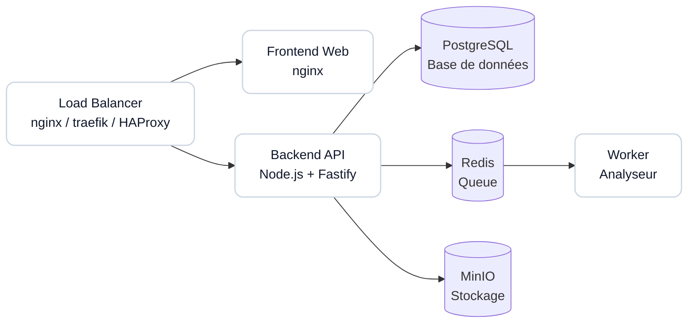

# Guide de Déploiement Production

Guide production unique pour déployer, diagnostiquer et monitorer Qubeless.

## Parcours rapide (Déployer + Vérifier)

```bash
touch .env.production
# Renseignez ensuite les variables du bloc "Exemple .env.production" plus bas
./scripts/validate-prod-config.sh
docker-compose -f docker-compose.prod.yml --env-file .env.production up -d
docker-compose -f docker-compose.prod.yml ps
curl http://localhost:3001/api/health
```

## Parcours rapide (Debug + Monitoring)

```bash
# logs temps réel
docker-compose -f docker-compose.prod.yml logs -f

# état des services
docker-compose -f docker-compose.prod.yml ps
curl http://localhost:3001/api/health

# métriques (si activées)
curl http://localhost:3001/api/metrics
```

## Prérequis

### Système

- **OS**: Linux (Ubuntu 22.04 LTS recommandé)
- **Docker**: Version 24.0 ou supérieure
- **Docker Compose**: Version 2.20 ou supérieure
- **CPU**: Minimum 4 cores (8 cores recommandés)
- **RAM**: Minimum 8 GB (16 GB recommandés)
- **Disque**: Minimum 50 GB d'espace libre (SSD recommandé)

### Ports requis

Les ports suivants doivent être disponibles :

- `3001` : API Backend (configurable via `API_PORT`)
- `8081` : Frontend Web (configurable via `WEB_PORT`)
- `5432` : PostgreSQL (configurable via `POSTGRES_PORT`)
- `6379` : Redis (configurable via `REDIS_PORT`)
- `9000` : MinIO API (configurable via `MINIO_PORT`)
- `9001` : MinIO Console (configurable via `MINIO_CONSOLE_PORT`)

### Accès réseau

- Accès sortant vers Docker Hub pour télécharger les images
- Accès sortant vers les dépôts Git si l'analyse de projets externes est nécessaire

### Exposition du socket Docker (Worker)

Le worker utilise `/var/run/docker.sock` pour lancer les conteneurs d'analyse. Cette exposition donne au conteneur worker un niveau de contrôle élevé sur l'hôte Docker.

Mesures recommandées:

- Déployer Qubeless sur un hôte ou une VM dédiée
- Restreindre strictement l'accès shell au conteneur worker et l'appartenance au groupe Docker
- Garder le worker non exposé (pas de ports publiés) et segmenter le réseau
- Durcir l'hôte (patchs OS, services minimaux, contrôle des accès)
- Lire la [politique de sécurité](../../SECURITY.md) avant mise en production

## Architecture de déploiement



### Composants

- **Web**: Frontend Vue.js servi par nginx
- **API**: Backend Node.js avec Fastify
- **Worker**: Service d'analyse asynchrone
- **PostgreSQL**: Base de données relationnelle
- **Redis**: Cache et file d'attente de jobs
- **MinIO**: Stockage d'objets S3-compatible

## Installation rapide

### 1. Cloner le dépôt

```bash
git clone https://github.com/qubeless/qubeless-monorepo.git
cd qubeless-monorepo
```

### 2. Créer le fichier d'environnement

```bash
touch .env.production
```

### 3. Configurer les variables d'environnement

Renseignez `.env.production` à partir du bloc `Exemple .env.production` de ce guide, puis remplacez les valeurs pour votre environnement.

### 4. Créer les répertoires de données

```bash
mkdir -p volumes/{postgres,redis,minio}
mkdir -p /tmp/{workspaces,analyzer-out}
```

### 5. Démarrer les services

```bash
docker-compose -f docker-compose.prod.yml --env-file .env.production up -d
```

### 6. Vérifier le déploiement

```bash
# Vérifier que tous les services sont en cours d'exécution
docker-compose -f docker-compose.prod.yml ps

# Vérifier les logs
docker-compose -f docker-compose.prod.yml logs -f

# Tester l'API
curl http://localhost:3001/api/health

# Tester le frontend
curl http://localhost:8081
```

## Exemple `.env.production`

```env
# Version
VERSION=latest

# Data Directory
DATA_DIR=./volumes

# PostgreSQL
POSTGRES_USER=postgres
POSTGRES_PASSWORD=changeme_secure_password
POSTGRES_DB=qubeless
POSTGRES_PORT=5432

# Redis
REDIS_PORT=6379

# MinIO
MINIO_ROOT_USER=minio_admin
MINIO_ROOT_PASSWORD=changeme_secure_minio_password
MINIO_PUBLIC_ENDPOINT=https://minio.example.com
MINIO_BUCKET_SOURCES=sources
MINIO_BUCKET_ARTIFACTS=artifacts
MINIO_PORT=9000
MINIO_CONSOLE_PORT=9001

# API
API_PORT=3001
JWT_SECRET=changeme_generate_a_secure_random_key_min_32_characters
JWT_EXPIRES_IN=7d
ADMIN_EMAIL=admin@example.com
ADMIN_PASSWORD=changeme_secure_admin_password
FRONTEND_ORIGIN=https://qubeless.example.com
AUTHZ_MODE=STRICT
MAX_RUNNING_ANALYSES=5
MAX_RUNNING_PER_PROJECT=2
METRICS_ENABLED=true

# Web
WEB_PORT=8081
VITE_API_URL=https://api.example.com/api
WEB_CSP_CONNECT_SRC=https://api.example.com

# Worker
WORKER_CONCURRENCY=2
WORKER_JOB_ATTEMPTS=2
WORKER_BACKOFF_MS=5000
ANALYZER_TIMEOUT_MS=600000
ANALYZER_MEMORY_MB=1024
ANALYZER_CPU_LIMIT=1
LOG_LEVEL=info
WORKSPACE_PATH=/workspace

# Site (optionnel)
SITE_BIND_HOST=127.0.0.1
SITE_PORT=8082
SITE_VITE_DOMAIN_APP=https://app.example.com
SITE_VITE_DOCS_URL=https://docs.example.com
SITE_VITE_GITHUB_URL=https://github.com/qubeless/qubeless-monorepo
SITE_VITE_SWAGGER_UI_URL=/api/docs
SITE_VITE_API_URL=

# SSO (optional)
SSO_OIDC_ENABLED=false
SSO_SAML_ENABLED=false
```

## Démarrage des services

### Démarrage complet

```bash
docker-compose -f docker-compose.prod.yml --env-file .env.production up -d
```

### Démarrage avec rebuild

```bash
docker-compose -f docker-compose.prod.yml --env-file .env.production up -d --build
```

### Démarrage d'un service spécifique

```bash
docker-compose -f docker-compose.prod.yml --env-file .env.production up -d api
```

### Arrêt des services

```bash
# Arrêt gracieux
docker-compose -f docker-compose.prod.yml down

# Arrêt avec suppression des volumes (ATTENTION: perte de données!)
docker-compose -f docker-compose.prod.yml down -v
```

### Redémarrage des services

```bash
# Redémarrer tous les services
docker-compose -f docker-compose.prod.yml restart

# Redémarrer un service spécifique
docker-compose -f docker-compose.prod.yml restart api
```

## Gestion des données

### Structure des volumes

```
volumes/
├── postgres/          # Données PostgreSQL
├── redis/            # Données Redis (AOF)
└── minio/            # Objets MinIO (sources, artifacts)

/tmp/
├── workspaces/       # Répertoires de travail temporaires
└── analyzer-out/     # Résultats d'analyse temporaires
```

### Vérification de l'espace disque

```bash
# Espace total utilisé par les volumes
du -sh volumes/

# Espace par service
du -sh volumes/postgres
du -sh volumes/redis
du -sh volumes/minio
```

### Nettoyage

```bash
# Nettoyer les workspaces temporaires
docker-compose -f docker-compose.prod.yml exec worker sh -c "rm -rf /tmp/workspaces/*"

# Nettoyer les résultats d'analyse temporaires
docker-compose -f docker-compose.prod.yml exec worker sh -c "rm -rf /tmp/analyzer-out/*"

# Nettoyer les images Docker non utilisées
docker image prune -a
```

## Monitoring et santé

### Vérification de l'état des services

```bash
# Statut de tous les services
docker-compose -f docker-compose.prod.yml ps

# Santé des services avec healthcheck
docker-compose -f docker-compose.prod.yml ps | grep healthy
```

### Healthchecks

Chaque service expose un healthcheck :

- **PostgreSQL**: `pg_isready -U postgres`
- **Redis**: `redis-cli ping`
- **MinIO**: `curl http://localhost:9000/minio/health/live`
- **API**: `http://localhost:3001/api/health`
- **Web**: `http://localhost:8081/`

### Logs

```bash
# Voir tous les logs
docker-compose -f docker-compose.prod.yml logs -f

# Logs d'un service spécifique
docker-compose -f docker-compose.prod.yml logs -f api

# Dernières 100 lignes
docker-compose -f docker-compose.prod.yml logs --tail=100 api

# Logs avec timestamps
docker-compose -f docker-compose.prod.yml logs -f --timestamps
```

### Métriques Prometheus

Si `METRICS_ENABLED=true`, les métriques Prometheus sont disponibles sur :

```
http://localhost:3001/api/metrics
```

Exemple de scrape config Prometheus :

```yaml
scrape_configs:
  - job_name: 'qubeless-api'
    static_configs:
      - targets: ['api.example.com:3001']
    metrics_path: '/api/metrics'
```

### Ressources système

```bash
# Utilisation CPU/RAM des containers
docker stats

# Utilisation spécifique à un service
docker stats qubeless-api

# Top des processus dans un container
docker-compose -f docker-compose.prod.yml exec api top
```

## Commandes utiles

```bash
# Alias utiles à ajouter dans ~/.bashrc
alias qube-up='docker-compose -f docker-compose.prod.yml --env-file .env.production up -d'
alias qube-down='docker-compose -f docker-compose.prod.yml down'
alias qube-logs='docker-compose -f docker-compose.prod.yml logs -f'
alias qube-ps='docker-compose -f docker-compose.prod.yml ps'
alias qube-restart='docker-compose -f docker-compose.prod.yml restart'
```
